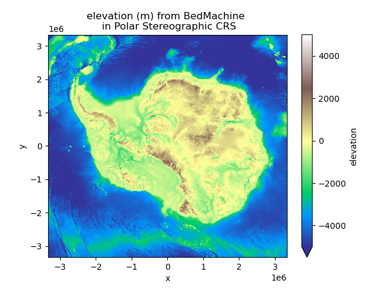
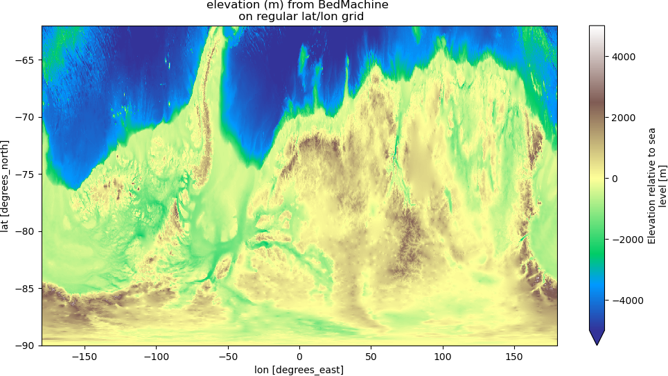

.. _largeproblems-label:

Solving large problems using HPC
================================

In some cases, the sizes of the source and target grids lead to weights that either take
too long to compute or can't fit into memory on a regular desktop/laptop machine. But fear not,
there are solutions to solve large regridding problems, provided you have access to a High
Performance Computing machine. Your ESMF installation (from conda or equivalent) comes with
command line tools (`ESMF_RegridWeightGen and ESMF_Regrid <http://www.earthsystemmodeling.org/esmf_releases/public/ESMF_8_0_0/ESMF_refdoc/node3.html>`_) that can be executed in parallel with
MPI. This allows very large regridding to be performed in minutes on hundred of compute cores.
Using these tools, we are able to regrid data at 500 meters resolution (13300x13300 pts) from 
a South Polar Stereographic projection to a 15' regular longitude/latitude grid (6720x86400 pts).
The original:

|polarstereo|

and after regridding:

|regular|

Although these tools are very performant, they lack critical documentation which makes them
hard to understand and operate. We're going to try to bridge those gaps with some real-life 
examples.
The roadblocks that you are most likely to find on your way are related to netcdf attributes
required by the ESMF tools. Error messages are not very informative and one may need to read the
source code to figure out what the problem is. The first **trick** you need to know is that
geographical coordinates both need **units** netcdf attributes and these units can only be
from the lists:

* *degrees_east, degree_east, degrees_E, degree_E, degreesE, degreeE* for longitude
* *degrees_north, degree_north, degrees_N, degree_N, degreesN, degreeN* for latitude

Otherwise, ESMF will fail with an error along the lines of *file type not recognized*.
For conservative regridding, the units of the longitude and latitude arrays at the cell
corners have to be *grid_corner_lon* and *grid_corner_lat*.

.. compound::

  output from **ncdump -h** on your netcdf file should look like::

    variables:
            double lat(lat) ;
                    lat:_FillValue = 1.e+20 ;
                    lat:units = "degrees_north" ;
            double lon(lon) ;
                    lon:_FillValue = 1.e+20 ;
                    lon:units = "degrees_east" ;

  dimensions and coordinates names do not need to be the same and coordinates can be 2d.

Creating weights on HPC and using them in xESMF
-----------------------------------------------

With your source and destination grids ready, you can now generate weights on your HPC system that
you can later use in xESMF by providing the **filename** and **reuse_weights=True** when creating
a regridder. The invocation to the weights generation on a MPI parallel system using 252 cores 
will look like:

.. code-block:: bash

    $ mpirun -np 252 ESMF_RegridWeightGen -s source.nc -d destination.nc -w weights.nc -m bilinear

In this example, we use bilinear regridding but all the methods available in xESMF are here too.
You can then import your weights generated on your HPC system in xESMF with:

.. code-block:: python

  import xarray as xr
  import xesmf as xe
  ds_in = xr.open_dataset('source.nc')
  ds_out = xr.open_dataset('destination.nc')
  regridder = xe.Regridder(ds_in, ds_out, 'bilinear',
                           filename='weights.nc',
                           reuse_weights=True)

There is a lot of options you can provide to **ESMF_RegridWeightGen** and you can have a list using:

.. code-block:: bash

    $ ESMF_RegridWeightGen --help

Some of particular interest are:

* **--netcdf4**: netcdf3 cannot handle very large files that can be produced here
* **--src_regional / --dst_regional**: if one of your grid is not periodic in longitude

Regrid variable(s) on HPC system
--------------------------------

If the weights you have generated don't fit into memory when using xESMF (e.g. you have an error of the
type *buffer size too small*), you still have the option to do the regridding of your variable on
the HPC using **ESMF_Regrid**. Here again, there is a **second trick** that you need to know:

.. compound::

  all the variables you want to regrid need to have a netcdf attribute named **coordinates** 
  that gives the list of its geographical coordinates, e.g.::

    variables:
            double lat(lat) ;
                    lat:_FillValue = 1.e+20 ;
                    lat:units = "degrees_north" ;
            double lon(lon) ;
                    lon:_FillValue = 1.e+20 ;
                    lon:units = "degrees_east" ;
            short elevation(lat, lon) ;
                    elevation:_FillValue = 32767s ;
                    elevation:units = "m" ;
                    elevation:standard_name = "height_above_reference_ellipsoid" ;
                    elevation:long_name = "Elevation relative to sea level" ;
                    elevation:coordinates = "lon lat" ;

  Also specifying a _FillValue explicitly instead of a NaN is also a good idea ;)

**ESMF_Regrid** will overwrite the destination.nc file and add the regridded variables so you
may want to make a copy in case (say output.nc). We can now invoke the regridding for the 
variable *elevation* on the HPC using:

.. code-block:: bash

    $ mpirun -np 720 ESMF_Regrid -s source.nc -d output.nc -m bilinear --src_var elevation --dst_var elevation --netcdf4

And this gets the job done! If for some reason, **ESMF_Regrid** dies with a MPI error, try increasing the
number of compute cores. Similarly, you can get the numerous available options with:

.. code-block:: bash

    $ ESMF_Regrid --help

There is a lot to unpack when it comes to the options so this might be a good time to start
exploring by yourself. Hopefully this gave you enough information to work it out.

Technical point: mpi4py considerations
--------------------------------------

If your HPC system does not provide a satisfying ESMF module, you may need to install it yourself
through conda. This is fine and should mostly work smoothly except that you may have some MPI issues
or conflicts. To use ESMF_Regrid, you will need to activate your conda env but it is likely that the
mpirun in it will not work on your HPC system because it hasn't been set up properly.

The solution is to install mpi4py from scratch and customize its mpi.cfg file to your MPI libraries
specifications. The block to add to mpi.cfg should look like this:

.. code-block:: bash

  [gaea-gnu]
  mpi_dir              = /opt/cray/pe/mpt/7.7.11/gni/mpich-gnu/8.2
  include_dirs         = %(mpi_dir)s/include
  libraries            = mpich
  library_dirs         = %(mpi_dir)s/lib
  runtime_library_dirs = %(mpi_dir)s/lib
  mpicc                = /opt/gcc/8.2.0/bin/gcc
  mpicxx               = /opt/gcc/8.2.0/bin/g++

And then recompile mpi4py from scratch:

.. code-block:: bash

    wget https://bitbucket.org/mpi4py/mpi4py/downloads/mpi4py-3.0.3.tar.gz
    tar -zxf mpi4py-3.0.3.tar.gz
    conda activate myenv
    cat gaea_mpi.cfg >> mpi4py-3.0.3/mpi.cfg
    pushd mpi4py-3.0.3
    python setup.py build --mpi=gaea-gnu
    python setup.py install
